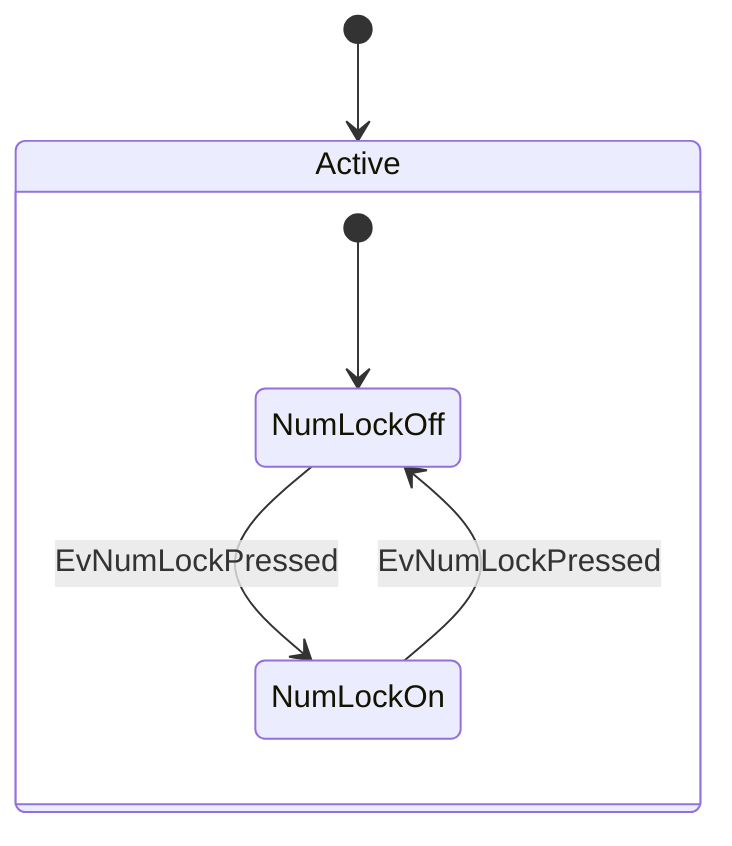

# Test Repo



Is this OK?

Raw:

```rust
fn main() {}
```

With spaces:

```rust file=test.rs id=3 comment=test
fn main() {}
```

With commas:

```rust,file=test.rs,id=3,comment=test
fn main() {}
```

test
