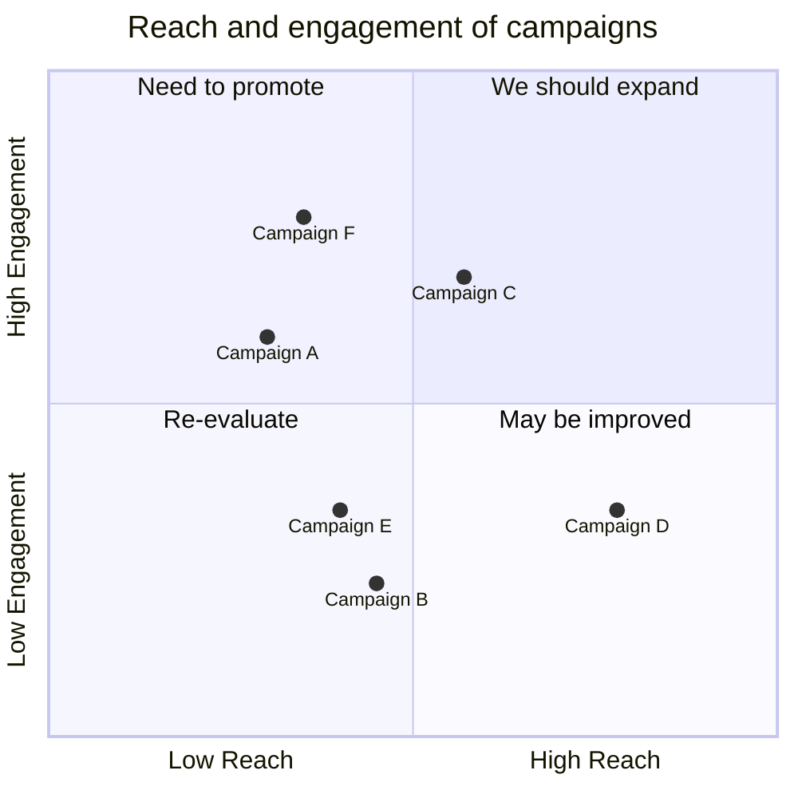

<div align="center">
  <!-- Crates version -->
  <a href="https://metacode.biz/@wiktor" rel="me">
    
  </a>
</div

# Test Repo


Flow:


Is this OK?

Packet:


Raw test:

```rust
fn main() {}
```

With spaces:

```rust file=test.rs id=3 comment=test
fn main() {}
```

With commas:

```rust,file=test.rs,id=3,comment=test
fn main() {}
```

test

Quadrant:


